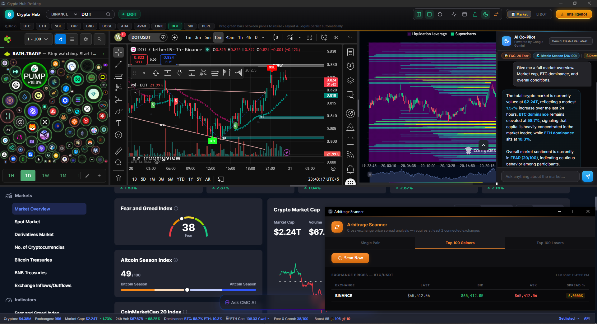

<div align="center">

# NexusDesk

**A premium desktop crypto trading command center.**

AI Co-Pilot · Live Market Intelligence · Cross-Exchange Arbitrage · Encrypted Vault

[](LICENSE)
[](https://www.electronjs.org/)
[](https://aistudio.google.com/)

</div>

---



---

## What is NexusDesk?

NexusDesk is a desktop trading command center built with Electron. It gives you a unified workspace with live charts, an AI trading assistant, an arbitrage scanner, and a portfolio manager — all in one dark-mode, premium interface.

The AI Co-Pilot knows your live portfolio balance, Fear & Greed Index, Altcoin Season status, top gainers/losers, and full coin market data — automatically, on every message.

---

## 🛠️ Tech Stack
- **Frontend:** HTML5, Vanilla CSS (Glassmorphism UI), JavaScript
- **Backend/Desktop:** Electron, Node.js
- **Integrations:** CCXT (Crypto APIs), Google Gemini AI, CoinMarketCap, LunarCrush
- **Security:** Windows DPAPI (`electron.safeStorage`)

---

## Features

- **AI Co-Pilot** — Ask anything. The AI already knows your balance, the Fear & Greed Index, top movers, BTC dominance, and market sentiment before you type a word.
- **Market Pulse Strip** — A live ticker at the top of the AI panel showing F&G, Altcoin Season Index, BTC dominance, and top 3 gainers/losers. Auto-refreshes every 15 minutes.
- **Arbitrage Scanner** — Detect price spreads across all your connected exchanges for a single pair, Top 100 Gainers, or Top 100 Losers.
- **Command Center Vault** — Manage all your API keys (Binance, Gemini AI, CMC, LunarCrush) in one place. All keys are encrypted using Windows DPAPI — never stored in plain text.
- **Trade Safety System** — The AI can *propose* a trade. You must manually click **Confirm** in a modal for it to execute. No trade ever runs automatically.
- **Live Portfolio** — Real-time balance from all connected exchanges (Spot + Futures merged).
- **Position Limits** — A server-side max position size check (default $50) that the AI cannot bypass.

---

## Security

| What | Where | Safe? |
|---|---|---|
| API keys (Binance, CMC, etc.) | `%AppData%\NexusDesk\hub-keys.json` | ✅ Encrypted with Windows DPAPI |
| App settings | `%AppData%\NexusDesk\hub-settings.json` | ✅ Encrypted, outside project folder |
| Session cookies (TradingView, etc.) | Electron `userData` — OS managed | ✅ Never in the project |
| Source code on GitHub | `D:\[Project]\NexusDesk` | ✅ Zero secrets in the code |

> **If someone clones this repo, they get zero access to your accounts, keys, or sessions.** Encrypted data lives in `AppData` on your machine only.

---

## Getting Started

### Requirements
- Windows 10 or 11
- [Node.js 18+](https://nodejs.org/)

### 1. Install & Run for Development

```bash
# Clone the repository
git clone https://github.com/Waleed-Khalid-dev/NexusDesk.git

# Navigate to the folder
cd NexusDesk

# Install all dependencies
npm install

# Start the desktop application
npm run desktop
```

*Alternatively, double-click `start.bat` — it installs dependencies on first run automatically.*

### 2. Build a Standalone Windows .exe

If you want to package the app into a standalone installer that you can share with others:

```bash
# 1. Install the Electron Builder package
npm install electron-builder --save-dev

# 2. Run the build command
npm run build
```

Once finished, look inside the newly created `dist/` folder. You will find `NexusDesk Setup 1.0.0.exe` ready to use.

---

## Setup: API Keys (enter in the Vault after launch)

| Key | Purpose | Where to get it |
|---|---|---|
| **Google Gemini API** | Powers the AI Co-Pilot | [aistudio.google.com/apikey](https://aistudio.google.com/apikey) — Free |
| **CoinMarketCap API** | Market cap, volume, top movers, supply data | [coinmarketcap.com/api](https://coinmarketcap.com/api/) — Free tier |
| **LunarCrush API** | Social sentiment, Galaxy Score, AltRank | [lunarcrush.com](https://lunarcrush.com/) — Free tier |
| **Binance API** | Live balance + optional trade execution | Binance → Account → API Management |
| **Other exchanges** | Any CCXT-supported exchange | Add in Vault |

> All keys are entered inside the app (**Vault** icon). Never use `.env` files — they are not needed and not supported.

---

## Project Structure

```
NexusDesk/
├── electron/
│   ├── main.cjs            Main process — IPC, security, trade engine
│   ├── market-intel.cjs    Market data — F&G, CMC, LunarCrush (15-min cache)
│   ├── ai-chat.html        AI Co-Pilot panel with Market Pulse strip
│   ├── portfolio.html      Command Center Vault
│   ├── arbitrage.html      Cross-exchange arbitrage scanner
│   ├── control.html        Top control bar
│   ├── preload.cjs         Electron preload
│   └── splitter.html       Layout drag handle
├── docs/
│   └── dashboard.png       Dashboard screenshot
├── .gitignore
├── LICENSE
├── README.md
├── package.json
└── start.bat
```

---

## Example AI Prompts

```
What is the Fear and Greed Index right now and what does it mean?
```
```
Is this Bitcoin season or Altcoin season? Where should I focus?
```
```
What are the top gainers today? Which ones look worth trading?
```
```
Analyze SOL — give me market cap, volume, supply, and social sentiment.
```
```
Based on current market conditions, which 3 coins would you pick today and why?
```

---

## Disclaimer

NexusDesk is a personal tool, not financial advice. Crypto trading carries significant risk. The developers are not responsible for any losses. Always do your own research.

---

## License

MIT — see [LICENSE](LICENSE).
