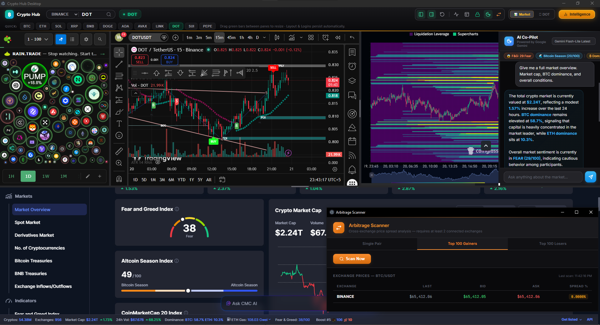

<div align="center">

# NexusDesk

**A premium desktop crypto trading command center.**

Multi-Tab Workspace · Perpetual Futures Engine · AI Co-Pilot · Live Market Intelligence · Cross-Exchange Arbitrage

[](LICENSE)
[](https://www.electronjs.org/)
[](https://aistudio.google.com/)

</div>

---



---

## What is NexusDesk?

NexusDesk is a desktop trading command center built with Electron. It gives you a unified **multi-tab workspace** with live charts, an AI trading assistant, an arbitrage scanner, a proactive market intelligence dashboard, and a portfolio manager — all in one dark-mode, premium interface.

Designed for professional traders, NexusDesk eliminates context-switching and browser clutter by keeping concurrent Chromium instances alive in background memory for instant, zero-flicker tab navigation.

---

## 🚀 Key Features

- **Smart Watchlist Drawer & Hover-to-Unsave** — An interactive, floating glassmorphism watchlist drawer that overlays chart views without shifting vertical layout bounds or obscuring active panes. Includes an intuitive hover-to-unsave dual-state action directly in the top navigation bar for rapid watchlist management without interrupting charting workflows.
- **Multi-Tab Workspace Monitoring (Option B Engine)** — Monitor different cryptocurrencies and exchanges simultaneously across independent tabs without breaking or reloading previous views. Powered by background Chromium processes (`WebContentsView`) with zero-flicker instant switching (<1ms) and an intelligent 10-tab resource cap to safeguard system memory.
- **Perpetual Futures (`.P`) Auto-Open Engine** — Integrated Market Type selector (`⚡ PERP (.P)` vs `🔘 SPOT`) in the top control bar that automatically routes TradingView chart URLs to perpetual derivative contracts across major exchanges (Binance, Bybit, MEXC, OKX, Bitget, Kucoin) so futures traders get instant derivative charting without manual searching.
- **Massive 400+ CoinMarketCap Coverage & Search Fallback** — Instant coin intelligence powered by an internal dictionary of over 400+ Layer 1s, DeFi protocols, AI tokens, memecoins, and gaming assets, supplemented by an intelligent search query fallback (`/search/?query=SYMBOL`) that completely eliminates 404 broken page errors.
- **Proactive Market Intelligence** — A real-time dashboard displaying macro indicators alongside deep derivative metrics.
- **Extreme Squeeze Radar** — Background observer tracking Live Funding Rates across exchanges. If any coin hits an extreme threshold (±0.5%), the app sends a desktop push notification and highlights it on the radar for potential short-squeezes.
- **Open Interest (OI) Tracking** — Automatically fetches Binance Global OI for extreme sentiment coins, showing exactly how much capital is fueling a squeeze.
- **Custom Pro-Watchlist** — Build a personalized watchlist that tracks Price, Social Galaxy Score, Funding Rates, and Open Interest. Uniquely supports **per-coin exchange selection** (e.g., track BTC from Binance and DEXE from MEXC in the same list).
- **Live Funding Rate Sparklines** — Track 12-hour derivative funding trends visually directly within the watchlist, using dynamic micro-charts rendered via Chart.js and CCXT.
- **Community Sentiment Engine** — Integrated LunarCrush v4 API for live Galaxy Scores and Bullish/Bearish ratio metrics.
- **AI Co-Pilot** — Ask anything. The AI already knows your balance, the Fear & Greed Index, top movers, BTC dominance, and market sentiment before you type a word.
- **Arbitrage Scanner** — Detect price spreads across all your connected exchanges for a single pair, Top 100 Gainers, or Top 100 Losers.
- **Command Center Vault** — Manage all your API keys (Binance, Gemini AI, CMC, LunarCrush) in one place. All keys are encrypted using Windows DPAPI — never stored in plain text.
- **Trade Safety System** — The AI can *propose* a trade. You must manually click **Confirm** in a modal for it to execute. No trade ever runs automatically.
- **Live Portfolio** — Real-time balance from all connected exchanges (Spot + Futures merged).

---

## 🛠️ Tech Stack & Dependencies

NexusDesk uses a highly optimized, minimalist dependency tree to keep the bundle size small and performance blazing fast.

- **Frontend:** HTML5, Vanilla CSS (Glassmorphism UI), JavaScript, Chart.js (CDN)
- **Backend/Desktop:** Electron 37 (`electron`), Node.js 18+
- **Database:** Pure-JS SQLite (`sql.js`) for the Portfolio Vault — No native C++ builds required.
- **Crypto Exchange APIs:** CCXT (`ccxt`) supporting 100+ global exchanges.
- **AI Engine:** Google Gemini AI (`@google/generative-ai`)
- **Security:** Windows DPAPI (`electron.safeStorage`) natively provided by Electron.

---

## Security

| What | Where | Safe? |
|---|---|---|
| API keys (Binance, CMC, etc.) | `%AppData%\NexusDesk\hub-keys.json` | ✅ Encrypted with Windows DPAPI |
| App settings | `%AppData%\NexusDesk\hub-settings.json` | ✅ Encrypted, outside project folder |
| Session cookies (TradingView, etc.) | Electron `userData` — OS managed | ✅ Never in the project |
| Source code on GitHub | `D:\[Project]\NexusDesk` | ✅ Zero secrets in the code |

> **If someone clones this repo, they get zero access to your accounts, keys, or sessions.** Encrypted data lives in `AppData` on your machine only.

---

## Getting Started

### Requirements
- Windows 10 or 11
- [Node.js 18+](https://nodejs.org/)

### 1. Install & Run for Development

This app requires exactly 4 NPM dependencies. To set it up cleanly:

```bash
# Clone the repository
git clone https://github.com/Waleed-Khalid-dev/NexusDesk.git

# Navigate to the folder
cd NexusDesk

# Install dependencies (@google/generative-ai, ccxt, sql.js, electron)
npm install

# Start the desktop application
npm run desktop
```

*Alternatively, double-click `start.bat` — it installs dependencies on first run automatically.*

### 2. Build a Standalone Windows .exe

If you want to package the app into a standalone installer that you can share with others:

```bash
# 1. Install the Electron Builder package
npm install electron-builder --save-dev

# 2. Run the build command
npm run build
```

Once finished, look inside the newly created `dist/` folder. You will find `NexusDesk Setup 1.0.0.exe` ready to use.

---

## Setup: API Keys (enter in the Vault after launch)

| Key | Purpose | Where to get it |
|---|---|---|
| **Google Gemini API** | Powers the AI Co-Pilot | [aistudio.google.com/apikey](https://aistudio.google.com/apikey) — Free |
| **CoinMarketCap API** | Market cap, volume, top movers, supply data | [coinmarketcap.com/api](https://coinmarketcap.com/api/) — Free tier |
| **LunarCrush API v4** | Social sentiment, Galaxy Score, AltRank | [lunarcrush.com](https://lunarcrush.com/) — Requires Individual Plan |
| **Binance API** | Live balance + optional trade execution | Binance → Account → API Management |
| **Other exchanges** | Any CCXT-supported exchange | Add in Vault |

> All keys are entered inside the app (**Vault** icon). Never use `.env` files — they are not needed and not supported.

---

## Project Structure

```
NexusDesk/
├── electron/
│   ├── main.cjs            Main process — IPC, Multi-Tab Engine, Perpetual Routing
│   ├── market-intel.cjs    Market data — Squeeze Radar, OI, CMC, LunarCrush
│   ├── market-intel-ui.html Proactive Squeeze Radar & Custom Watchlist UI
│   ├── ai-chat.html        AI Co-Pilot panel with Market Pulse strip
│   ├── portfolio.html      Command Center Vault
│   ├── portfolio.cjs       Vault Encryption and SQLite engine
│   ├── arbitrage.html      Cross-exchange arbitrage scanner
│   ├── control.html        Top control bar with Market Type toggle (PERP/SPOT)
│   ├── preload.cjs         Electron preload bridge
│   └── splitter.html       Layout drag handle
├── docs/
│   └── dashboard.png       Dashboard screenshot
├── .gitignore
├── LICENSE
├── README.md
├── package.json
└── start.bat
```

---

## Example AI Prompts

```
What is the Fear and Greed Index right now and what does it mean?
```
```
Is this Bitcoin season or Altcoin season? Where should I focus?
```
```
What are the top gainers today? Which ones look worth trading?
```
```
Analyze SOL — give me market cap, volume, supply, and social sentiment.
```
```
Based on current market conditions, which 3 coins would you pick today and why?
```

---

## Disclaimer

NexusDesk is a personal tool, not financial advice. Crypto trading carries significant risk. The developers are not responsible for any losses. Always do your own research.

---

## License

MIT — see [LICENSE](LICENSE).
